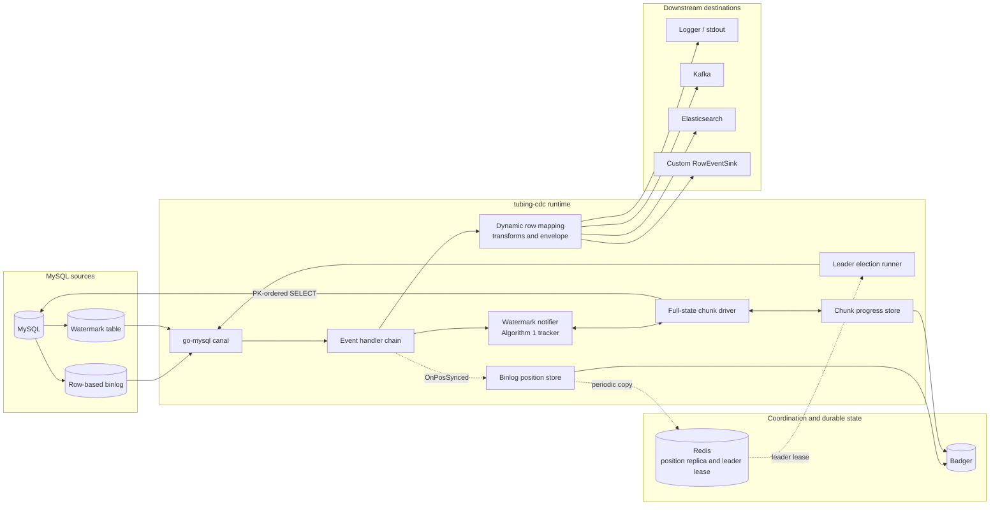
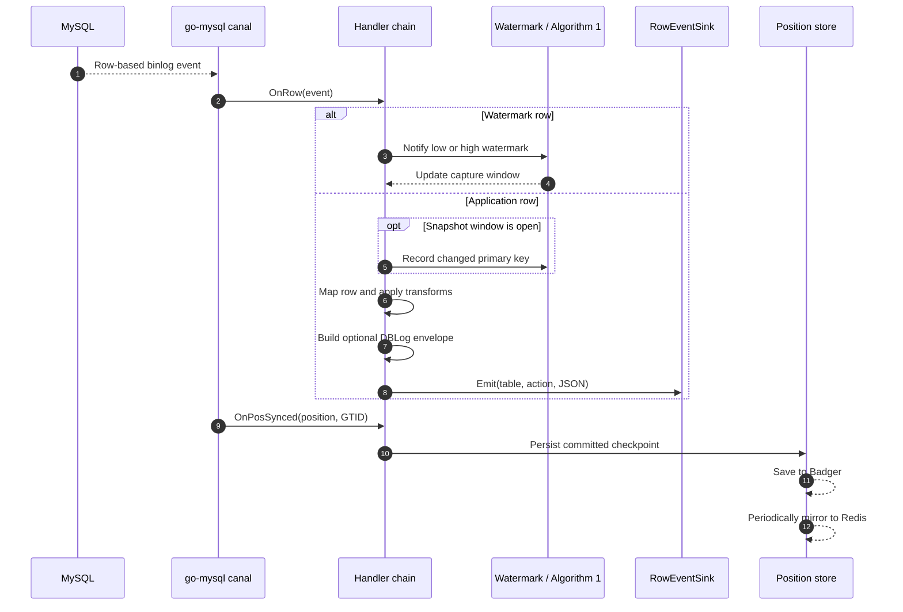

# tubing-cdc

`tubing-cdc` is a lightweight Change Data Capture library for MySQL, written in Go and built on top of [go-mysql canal](https://github.com/go-mysql-org/go-mysql). It streams row-level binlog changes to pluggable handlers and sinks, persists replication progress, and provides the building blocks for DBLog-style consistent full-state capture.

The project is designed for applications that need an embeddable CDC component rather than a separate data platform. It currently supports MySQL only.

## Highlights

- MySQL row-level binlog streaming with table-level filtering
- Insert, update, and delete events serialized as JSON
- Pluggable `EventHandler` and `RowEventSink` interfaces
- Built-in stdout, logger, Kafka, and Elasticsearch sinks
- Optional DBLog-compatible event envelopes
- Binlog position persistence in Badger with optional Redis replication
- Watermark recognition, primary-key chunking, and Algorithm 1 reconciliation
- Redis-backed leader election for active/passive deployments
- Multiple independent MySQL sources in one process

## Architecture



Each MySQL source owns an independent canal instance and handler chain. `MultiMySQLCDC` composes several of these pipelines, while persistence keys can be scoped per source so they safely share Badger or Redis.

## How it works



The normal path follows committed binlog events and emits them in canal callback order. Full-state capture is an opt-in companion path: the driver writes low and high watermarks around a primary-key-ordered chunk query, removes snapshot rows whose keys changed inside that window, emits the surviving rows, and persists the next chunk cursor.

## Project status

The MySQL binlog pipeline and the DBLog P0-P6 components described in the [roadmap](docs/roadmap.md) are implemented and covered by unit and integration tests. Some advanced capabilities remain intentionally limited:

- The built-in snapshot driver does not pause binlog consumption during a chunk cycle.
- Snapshot envelopes may require application-provided primary-key metadata.
- Leader election uses Redis leases; it is not a complete cluster-coordination layer.
- PostgreSQL and other database engines are not supported.

Review [coverage versus DBLog](docs/coverage-vs-dblog.md) before relying on the snapshot or HA features in a production design.

## Installation

Install the latest published version with Go:

```bash
go get github.com/tubing-data/tubing-cdc@v0.0.1
```

Then import the module in your application:

```go
import tubingcdc "github.com/tubing-data/tubing-cdc"
```

For reproducible builds, keep the version in `go.mod` (for example, `v0.0.1`) and commit both
`go.mod` and `go.sum`. The library does not install or manage MySQL, Redis, Kafka, or Elasticsearch;
provide those services separately only when the corresponding persistence, HA, or sink features are
enabled. A Docker-based local environment is available with `make demo`; see the [quick start](docs/quick-start.md).

## Requirements

- Go 1.21 or later
- MySQL with binary logging enabled
- Row-based binlog format
- A MySQL account with `SELECT`, `REPLICATION SLAVE`, and `REPLICATION CLIENT` privileges

Every configured table must use the fully qualified `database.table` form.

## Quick start

For a complete MySQL binlog -> event processing -> Elasticsearch flow, use the Docker quick start:

```bash
make demo
```

This builds the included application image, starts MySQL and Elasticsearch, performs a DBLog-style startup full sync of any existing orders, writes a sample order, and prints the indexed document. Changes made while the full sync is running continue through the binlog path; rows whose primary keys changed inside a snapshot watermark window are removed from that snapshot chunk so the incremental value wins. See [Quick start: MySQL CDC to Elasticsearch](docs/quick-start.md) for insert, update, delete, verification, troubleshooting, and all shortcut commands.

For an interactive walkthrough, run `make interactive`, enter your own SQL, and inspect the original `before`/`after` event, processed event, and Elasticsearch result after every change.

To embed tubing-cdc in your own Go application:

```go
package main

import (
	"log"

	tubingcdc "github.com/tubing-data/tubing-cdc"
)

func main() {
	tables := []string{"commerce.orders", "commerce.customers"}

	handler := tubingcdc.NewDynamicTableEventHandler(
		tables,
		tubingcdc.WithRowEventSink(tubingcdc.StdoutRowSink{}),
		tubingcdc.WithDBLogEnvelope(true),
	)

	cdc, err := tubingcdc.NewTubingCDC(&tubingcdc.Configs{
		Address:      "127.0.0.1:3306",
		Username:     "cdc_user",
		Password:     "secret",
		Tables:       tables,
		EventHandler: handler,
	})
	if err != nil {
		log.Fatal(err)
	}
	defer cdc.Close()

	// Run blocks while following the MySQL binlog.
	if err := cdc.Run(); err != nil {
		log.Fatal(err)
	}
}
```

Use `RunFrom(mysql.Position)` when the application needs to resume from a known binlog position. For durable checkpointing, configure position persistence as shown below, read the saved position on startup, and pass it to `RunFrom`.

Alternatively, `RunTubingCDCWithRecovery(ctx, cfg)` performs that lookup automatically. It prefers
the Redis checkpoint when configured, falls back to local Badger, and starts at the current master
position only when no checkpoint exists.

## Event model

`DynamicTableEventHandler` emits one JSON document for every changed row. Update events contain both the previous and current values. With `WithDBLogEnvelope(true)`, the row payload is wrapped with stable metadata:

```json
{
  "schema_version": "tubing-cdc-envelope-v0",
  "origin": "log",
  "action": "insert",
  "table": {
    "database": "commerce",
    "table": "orders"
  },
  "primary_key": {
    "id": 42
  },
  "payload": {
    "id": 42,
    "status": "created"
  }
}
```

See [event envelopes](docs/event-envelope.md) for the complete schema and compatibility notes.

## Output destinations

Attach a sink with `WithRowEventSink`:

| Sink | Purpose |
| --- | --- |
| `LoggerRowSink` | Writes CDC events through the project logger; this is the default. |
| `StdoutRowSink` | Writes line-oriented events to stdout or another `io.Writer`. |
| `KafkaRowEventSink` | Publishes JSON events to a Kafka topic. |
| `ElasticsearchRowEventSink` | Indexes or deletes documents through the Elasticsearch HTTP API. |
| Custom `RowEventSink` | Sends events to an application-specific destination. |

Handlers can also apply field transformations before serialization. Configuration examples are available in [event handlers and sinks](docs/event-handlers.md).

For production delivery, wrap a sink with `NewReliableRowEventSink`. The wrapper serializes
concurrent binlog/snapshot calls, retries transient failures, optionally emits a `DeadLetterEvent`,
and exposes `RuntimeMetrics.Snapshot()` counters. Pass the same wrapped sink instance to the
binlog handler and `FullSync.RowSink`.

## Position persistence

The current binlog file, offset, and optional GTID can be stored locally in Badger. Redis can receive periodic copies for recovery by another process.

```go
cfg.PositionPersistence = &tubingcdc.PositionPersistence{
	BadgerDir:            "./data/positions",
	RedisAddr:            "127.0.0.1:6379", // Optional.
	FlushToRedisInterval: 30 * time.Second,
	GTIDFlavor:           "mysql",
}
```

Always call `Close` during shutdown so the final position is flushed and storage resources are released. See [position persistence](docs/position-persistence.md) for recovery examples and storage semantics.

## DBLog-style snapshots and high availability

The repository includes composable support for the watermark-based algorithm described in *DBLog: A Watermark Based Change-Data-Capture Framework*:

1. A source watermark table and binlog notifier
2. Primary-key ordered chunk queries and durable chunk cursors
3. Low/high watermark tracking and changed-key reconciliation
4. A full-state job queue and background chunk driver
5. Redis-backed leader election

These pieces are opt-in and require explicit orchestration and configuration. Start with the [Algorithm 1 chunk driver guide](docs/algorithm1-chunk-driver.md), then review the [architecture](docs/architecture.md) and [correctness coverage](docs/coverage-vs-dblog.md).

For the common bootstrap case, `Configs.FullSync` performs the orchestration automatically. `Run` first anchors a binlog position, then snapshots every configured table in PK-ordered chunks while the binlog is consumed, and finally keeps tailing the binlog:

```go
cfg.Watermark = &tubingcdc.WatermarkTableConfig{TableKey: "app.cdc_watermark"}
cfg.ChunkProgressPersistence = &tubingcdc.ChunkProgressPersistence{BadgerDir: "./cdc-state"}
cfg.FullSync = &tubingcdc.FullSyncConfig{
	Tables: []tubingcdc.FullStateTableSpec{
		{TableKey: "app.users", PKColumns: []string{"id"}, ChunkSize: 1000},
		{TableKey: "app.orders", PKColumns: []string{"id"}, ChunkSize: 1000},
	},
	RowSink:     sink, // normally the same sink used by the binlog handler
	UseEnvelope: true,
}

go func() {
	if err := <-cdc.FullSyncDone(); err != nil {
		log.Printf("full sync failed: %v", err)
	}
}()

if err := cdc.Run(); err != nil {
	log.Fatal(err)
}
```

The default starts a fresh snapshot on each process start. Set `FullSync.Resume` to retain an incomplete cursor across restarts. The watermark table must already exist and its singleton row must be seeded using `WatermarkCreateTableSQL`.

During FullSync, binlog consumption is not stopped. For each chunk, changes between its low and high watermarks are emitted normally through the incremental handler and their primary keys are recorded. Conflicting rows are then removed from the snapshot output, so an older snapshot value cannot overwrite an update or resurrect a delete observed in that window. Use an idempotent, primary-key-based sink; if the incremental handler applies transformations, apply the same transformations to the FullSync sink as demonstrated by `cmd/quickstart`.

## Multiple MySQL sources

`MultiMySQLCDC` runs one independent `TubingCDC` instance per source. Give each source a stable ID and call `ApplyMySQLSourcePersistenceScope` when instances share a Badger directory or Redis key space.

```go
sources := []tubingcdc.MySQLSourceSpec{
	{ID: "orders-primary", Config: ordersConfig},
	{ID: "billing-primary", Config: billingConfig},
}

for i := range sources {
	if err := tubingcdc.ApplyMySQLSourcePersistenceScope(
		sources[i].Config,
		sources[i].ID,
	); err != nil {
		log.Fatal(err)
	}
}

multi, err := tubingcdc.NewMultiMySQLCDC(sources)
if err != nil {
	log.Fatal(err)
}
defer multi.Close()

if err := multi.Run(context.Background()); err != nil {
	log.Fatal(err)
}
```

## Local development

Start the local MySQL and Elasticsearch services:

```bash
docker compose up -d
```

Run the test suite:

```bash
go test ./...
```

Run the full repository verification before submitting a change:

```bash
bash scripts/codex/check.sh
```

Docker-backed integration tests are skipped when a Docker daemon is unavailable. See [development](docs/development.md) for the local service credentials, test strategy, and benchmark commands.

## Documentation

| Guide | Description |
| --- | --- |
| [Usage](docs/usage.md) | Core client configuration and execution |
| [Architecture](docs/architecture.md) | Runtime components and data flow |
| [Event handlers and sinks](docs/event-handlers.md) | JSON handlers, transforms, Kafka, and Elasticsearch |
| [Event envelope](docs/event-envelope.md) | Unified log and snapshot event schema |
| [Position persistence](docs/position-persistence.md) | Badger and Redis recovery state |
| [Algorithm 1 driver](docs/algorithm1-chunk-driver.md) | Watermarked chunk capture |
| [Coverage versus DBLog](docs/coverage-vs-dblog.md) | Implemented guarantees and known gaps |
| [Roadmap](docs/roadmap.md) | Delivery phases and future work |
| [Development](docs/development.md) | Local environment, tests, and benchmarks |
| [References](docs/references.md) | DBLog paper and related material |

## Contributing

Issues and pull requests are welcome. Keep changes focused, format modified Go files with `gofmt`, add tests for behavior changes, and run `bash scripts/codex/check.sh` before opening a pull request.

## Acknowledgements

`tubing-cdc` builds on [go-mysql](https://github.com/go-mysql-org/go-mysql) and is informed by the DBLog paper by Andreas Andreakis and Ioannis Papapanagiotou. See [references](docs/references.md) for the full citation.
