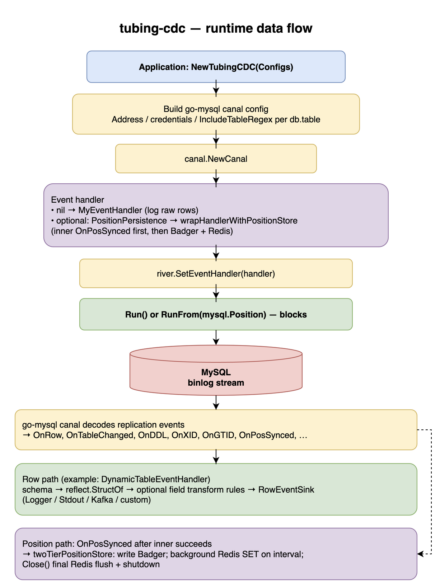

# Architecture (runtime flow)

The diagram below summarizes how configuration becomes a live binlog consumer, how events reach your handler (including optional dynamic row handling and sinks), and how position persistence layers on `OnPosSynced`.

Editable source: [tubing-cdc-flow.drawio](tubing-cdc-flow.drawio) (open in [draw.io](https://app.diagrams.net/) or the desktop app). To regenerate the PNG after editing, use the draw.io desktop CLI, for example: `draw.io -x -f png -o docs/tubing-cdc-flow.png docs/tubing-cdc-flow.drawio` (the `draw.io` binary path depends on your OS install).

See also [coverage-vs-dblog.md](coverage-vs-dblog.md) for a high-level capability map and planned components.
