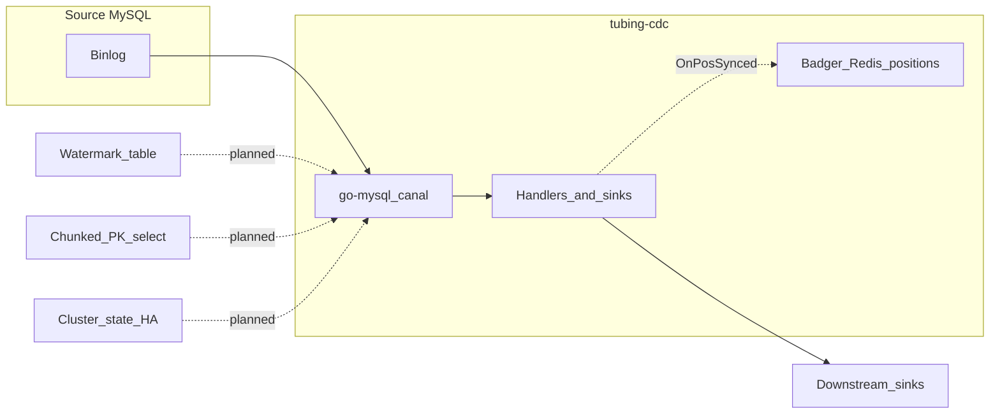

# Coverage vs DBLog

DBLog combines (1) ordered row events from the database transaction log, (2) **chunked full-state** reads between **low/high watermarks** written to a dedicated table, with in-memory reconciliation so snapshot rows do not override newer log history, (3) a **state store** (ZooKeeper in the paper) for log offset, chunk progress, and **leader election**, and (4) a **single output event shape** for both log- and snapshot-origin rows. This repository currently delivers the log tail and operator-facing position storage; the watermark algorithm and chunked snapshot path are the main gap.

| Capability | In DBLog (paper) | In tubing-cdc today |
|------------|------------------|----------------------|
| Transaction log row capture (commit order) | Yes | Yes (MySQL binlog via canal) |
| Output ordering / sink pipeline | In-memory buffer + ordered writer | Handler and `RowEventSink` (e.g. log, stdout, Kafka) |
| Binlog position persistence for restarts | State store (ZK) | Badger + optional Redis (`PositionPersistence`) |
| Full-state via chunked PK `SELECT` | Yes | No |
| Watermark table + low/high window + PK reconciliation | Yes (Algorithm 1) | Watermark table DDL + binlog row parsing/notifier (P1); no Algorithm 1 window yet |
| Same envelope for log vs snapshot rows | Yes | No (canal-oriented JSON today) |
| Chunk progress, pause/resume, API triggers | Yes | No |
| Active/passive HA | Yes | Redis leader lease + standby retry (`RunTubingCDCWithLeaderElection`); not full ZK-style cluster metadata |
| Multi-DB (e.g. PostgreSQL) | Discussed | No (MySQL only) |
| Canal `mysqldump` dump path | N/A | Disabled (`Dump.ExecutionPath == ""` in `data_flow.go`) |

For the detailed runtime diagram (config → handler → sinks → position sync), see [architecture.md](architecture.md). For what ships next, see [roadmap.md](roadmap.md).
