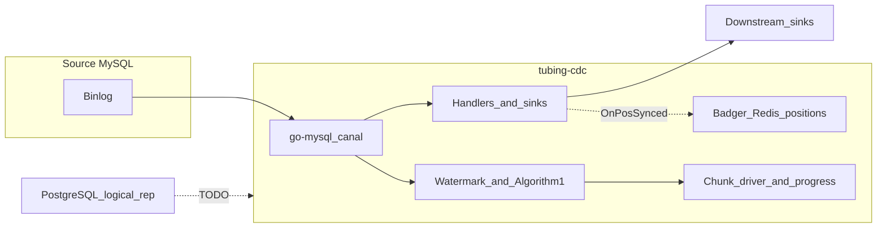

# Coverage vs DBLog

DBLog combines (1) ordered row events from the database transaction log, (2) **chunked full-state** reads between **low/high watermarks** with in-memory reconciliation so snapshot rows do not override newer log history, (3) a **state store** for log offset, chunk progress, and **leader election**, and (4) a **single output event shape** for log- and snapshot-origin rows. **tubing-cdc** implements the MySQL/canal side of (1)–(4) for P0–P6 as in [roadmap.md](roadmap.md), with the caveats below.

| Capability | In DBLog (paper) | In tubing-cdc today |
|------------|------------------|----------------------|
| Transaction log row capture (commit order) | Yes | Yes (MySQL binlog via canal) |
| Output ordering / sink pipeline | In-memory buffer + ordered writer | Handler and `RowEventSink` (e.g. log, stdout, Kafka); optional `WithDBLogEnvelope` |
| Binlog position persistence for restarts | State store (ZK) | Badger + optional Redis (`PositionPersistence`) |
| Full-state via chunked PK `SELECT` | Yes | Yes — `BuildPKOrderedChunkSelect`, `BuildPKRowsInSelect`, chunk driver (`StartAlgorithm1ChunkDriver`) |
| Watermark table + low/high window + PK reconciliation | Yes (Algorithm 1) | Yes — P1 watermark + P3 `Algorithm1Tracker` + P4 driver; **built-in driver does not pause binlog consumption** (see [algorithm1-chunk-driver.md](algorithm1-chunk-driver.md)) |
| Same envelope for log vs snapshot rows | Yes | Yes — P0 envelope; snapshot path passes `nil` `schema.Table` so `primary_key` may be empty unless extended |
| Chunk progress, pause/resume, API triggers | Yes | Yes — `ChunkProgressStore`, `ChunkProcessingControl`, `FullStateJobQueue` / `PlanFullStateJobs` |
| Active/passive HA | Yes | Redis leader lease (`RunTubingCDCWithLeaderElection`); not full ZK-style cluster metadata |
| Multi-DB (e.g. PostgreSQL) | Discussed | No (MySQL only); P6 supports multiple MySQL sources |
| Canal `mysqldump` dump path | N/A | Disabled (`Dump.ExecutionPath == ""` in `data_flow.go`) |

For the detailed runtime diagram (config → handler → sinks → position sync), see [architecture.md](architecture.md). For verification and benchmarks, see [testing-dblog-matrix.md](testing-dblog-matrix.md). For phase detail, see [roadmap.md](roadmap.md).
